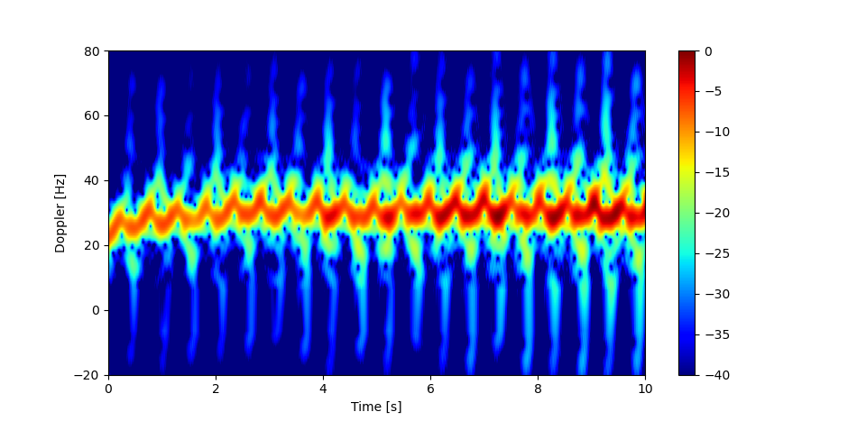

# micro-Doppler feature extraction

This repo contains a small example of how to extract features from a micro-Doppler spectrogram. A subset of the features are statistical moments of quantities which are expressed by the instantanious Doppler frequency of the radar measurments.

Run

    python main.py
to plot the spectrogram in *spectrogram.pickle* and print it's feature characterization.

